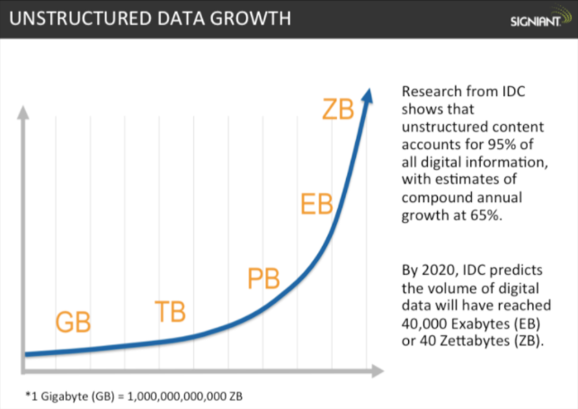

# awesome-text-summarization

The guide to tackle with the Text Summarization. 

## Motivation

We want to catch up up-to-date information to take a suitable action. But on the contrary, the amount of the information is more and more growing. There are many categories of information (economy, sports, health, technology...) and also there are many sources (news site, blog, SNS...).

*from [THE HISTORICAL GROWTH OF DATA: WHY WE NEED A FASTER TRANSFER SOLUTION FOR LARGE DATA SETS](https://www.signiant.com/articles/file-transfer/the-historical-growth-of-data-why-we-need-a-faster-transfer-solution-for-large-data-sets/)*

So to make an automatically & accurate summaries feature will helps us to **understand** the topics and **shorten the time** to do it.

## Task Definition

Summarization is the function that takes some documents and outputs the summary.

* Single document summarization
  * *summary = summarize(document)*
* Multi-document summarization
  * *summary = summarize(document_1, document_2, ...)*
  * Sometimes user provides the multiple documents by query

This basic task is so-called "Generic summarization". It produces the summary for everybody. In contrast, to specify the topic or some keywords is called "Query focused summarization". 

* Query focused summarization
  * *summary = summarize(document, query)*

As like our minutes of the meeting, there is a scene that we want to focus on the difference between the previous time and this time. It is called "Update summarization".

* Update summarization
  * *summary = summarize(document, previous_document_or_summary)*

The "summary" itself has some variety.

* Indicative summary
  * It likes a summary of the book. It describes what kinds of the story, but not tell all of the story especially its ends (so indicative summary has only partial information).
* Informative summary
  * The summary that summarizes fully information of the document.
* Keyword summary
  * A set of indicative words or phrases mentioned in the input document.
* Headline summary
  * Only one line summary.

**Discussion**

`Generic summarization` is really useful? Sparck Jones argued that summarization should not be done in a vacuum, but rather done according to the purpose of summarization ([2]). She argued that generic summarization is not necessary and in fact, wrong-headed. On the other hand, the headlines and 3-line summaries in the newspaper helps us.

## Approach

There are mainly two ways. Extractive and Abstractive.

### Extractive

* Select relevant phrases of the input document and concatenate them to form a summary (like "copy-and-paste").
* Pros: They are quite robust since they use existing natural-language phrases that are taken straight from the input.
* Cons: But they lack in flexibility since they cannot use novel words or connectors. They also cannot paraphrase like people sometimes do.

### Abstractive 

* Generate a summary that keeps original intent. It's just like humans do.
* Pros: They can use words that were not in the original input. It enables to make more fluent and natural summaries.
* Cons: But it is also a much harder problem as you now require the model to generate coherent phrases and connectors.

Extractive & Abstractive is not conflicting ways. You can use both to generate the summary. And there are a way collaborate with human.

* Aided Summarization
  * Combines automatic methods with human input.
  * Computer suggests important information from the document, and the human decide to use it or not. It uses information retrieval, and text mining way.

## Evaluation

* [ROUGE](https://en.wikipedia.org/wiki/ROUGE_(metric))
* BLEU

[The difference between ROUGE and BLEU](https://stackoverflow.com/questions/38045290/text-summarization-evaluation-bleu-vs-rouge)

Summarization is used to evaluate the "machine comprehension". Good reading = Good summarization.

## Implementation

* [TensorFlow summarization](https://github.com/tensorflow/models/tree/master/research/textsum)
  * Dataset: [Annotated English Gigaword](https://catalog.ldc.upenn.edu/LDC2012T21)

## References

* Wikipedia
  * [Automatic summarization](https://en.wikipedia.org/wiki/Automatic_summarization)
* Blogs
  * [Text summarization with TensorFlow](https://research.googleblog.com/2016/08/text-summarization-with-tensorflow.html)
  * [Your tl;dr by an ai: a deep reinforced model for abstractive summarization](https://einstein.ai/research/your-tldr-by-an-ai-a-deep-reinforced-model-for-abstractive-summarization)
* Papers
  1. A. Nenkova and K. McKeown,  "[Automatic summarization](https://www.cis.upenn.edu/~nenkova/1500000015-Nenkova.pdf),". Foundations and Trends in Information Retrieval, 5(2-3):103–233, 2011.
  2. K. Sparck Jones, “[Automatic summarizing: factors and directions](),”. Advances in Automatic Text Summarization, pp. 1–12, MIT Press, 1998.
