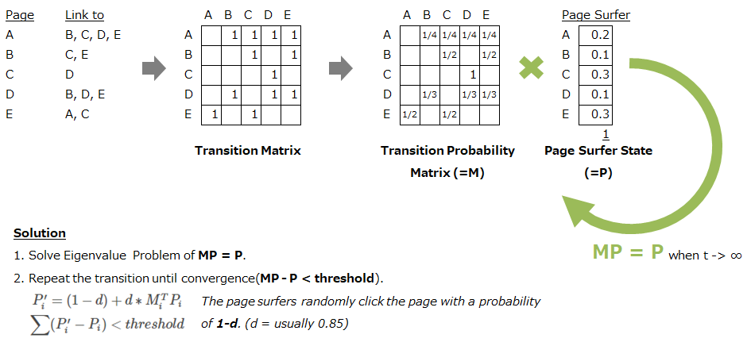
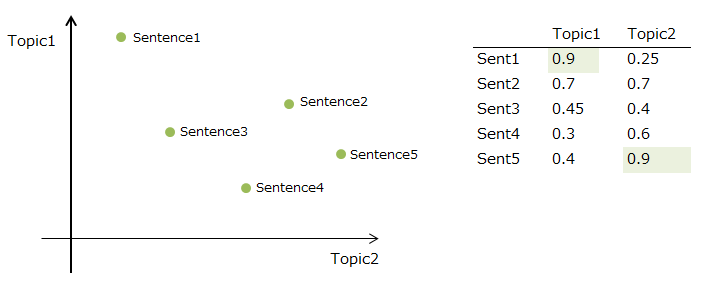

# awesome-text-summarization

The guide to tackle with the Text Summarization. 

* [Motivation](#motivation)
* Task Definition
* Basic Approach
  * Extractive
  * Abstractive
* Evaluation
* Resources
  * Datasets
  * Libraries
  * Articles
  * Papers

## Motivation

To take the appropriate action, we need latest information.  
But on the contrary, the amount of the information is more and more growing. There are many categories of information (economy, sports, health, technology...) and also there are many sources (news site, blog, SNS...).

  
  
<i>
    from <a href="https://www.signiant.com/articles/file-transfer/the-historical-growth-of-data-why-we-need-a-faster-transfer-solution-for-large-data-sets/" target="_blank">THE HISTORICAL GROWTH OF DATA: WHY WE NEED A FASTER TRANSFER SOLUTION FOR LARGE DATA SETS</a>
  </i>

So to make an automatically & accurate summaries feature will helps us to **understand** the topics and **shorten the time** to do it.

## Task Definition

Basically, we can regard the "summarization" as the "function" its input is document and output is summary. And its input & output type helps us to categorize the multiple summarization tasks.

* Single document summarization
  * *summary = summarize(document)*
* Multi-document summarization
  * *summary = summarize(document_1, document_2, ...)*

We can take the query to add the viewpoint of summarization.

* Query focused summarization
  * *summary = summarize(document, query)*

This type of summarization is called "Query focused summarization" on the contrary to the "Generic summarization". Especially, a type that set the viewpoint to the "difference" (update) is called "Update summarization".

* Update summarization
  * *summary = summarize(document, previous_document_or_summary)*

And the *"summary"* itself has some variety.

* Indicative summary
  * It looks like a summary of the book. This summary describes what kinds of the story, but not tell all of the stories especially its ends (so indicative summary has only partial information).
* Informative summary
  * In contrast to the indicative summary, the informative summary includes full information of the document.
* Keyword summary
  * Not the text, but the words or phrases from the input document.
* Headline summary
  * Only one line summary.

**Discussion**

`Generic summarization` is really useful? Sparck Jones argued that summarization should not be done in a vacuum, but rather done according to the purpose of summarization ([2](https://www.cl.cam.ac.uk/archive/ksj21/ksjdigipapers/summbook99.pdf)). She argued that generic summarization is not necessary and in fact, wrong-headed. On the other hand, the headlines and 3-line summaries in the newspaper helps us.

## Basic Approach

There are mainly two ways to make the summary. Extractive and Abstractive.

### Extractive

* Select relevant phrases of the input document and concatenate them to form a summary (like "copy-and-paste").
  * Pros: They are quite robust since they use existing natural-language phrases that are taken straight from the input.
  * Cons: But they lack in flexibility since they cannot use novel words or connectors. They also cannot paraphrase like people sometimes do.

Now I show the some categories of extractive summarization.

#### Graph Base

Make the graph from the document, then summarize it by considering the relation between the nodes (text-unit). `TextRank` is the typical graph based method.

**[TextRank](https://web.eecs.umich.edu/~mihalcea/papers/mihalcea.emnlp04.pdf)**

TextRank is based on [PageRank](https://en.wikipedia.org/wiki/PageRank) algorithm that is used on Google Search Engine. Its base concept is "The linked page is good, much more if it from many linked page". The links between the pages are expressed by matrix (like Round-robin table). We can convert this matrix to transition probability matrix by dividing the sum of links in each page. And the page surfer moves the page according to this matrix.

*Page Rank Algorithm*

TextRank regards words or sentences as pages on the PageRank. So when you use the TextRank, following points are important.

* Define the "text units" and add them as the nodes in the graph.
* Define the "relation" between the text units and add them as the edges in the graph.
  * You can set the weight of the edge also.

Then, solve the graph by PageRank algorithm. [LexRank](https://www.cs.cmu.edu/afs/cs/project/jair/pub/volume22/erkan04a-html/erkan04a.html) uses the sentence as node and the similarity as relation/weight (similarity is calculated by IDF-modified Cosine similarity).

If you want to use TextRank, following tools support TextRank.

* [gensim](https://radimrehurek.com/gensim/summarization/summariser.html)
* [pytextrank](https://github.com/ceteri/pytextrank)

#### Feature Base

Extract the features of sentence, then evaluate its importance. Here is the representative research.

[Sentence Extraction Based Single Document Summarization](http://oldwww.iiit.ac.in/cgi-bin/techreports/display_detail.cgi?id=IIIT/TR/2008/97)

In this paper, following features are used.

* Position of the sentence in input document
* Presence of the verb in the sentence
* Length of the sentence
* Term frequency 
* Named entity tag NE
* Font style

...etc. All the features are accumulated as the score.

The `No.of coreferences` are the number of pronouns to previous sentence. It is simply calculated by counting the pronouns occurred in the first half of the sentence. So the Score represents the reference to the previous sentence.

Now we can evaluate each sentences. Next is selecting the sentence to avoid the duplicate of the information. In this paper, the same word between the new and selected sentence is considered. And the refinement to connect the selected sentences are executed.

[Luhn’s Algorithm](http://courses.ischool.berkeley.edu/i256/f06/papers/luhn58.pdf) is also feature base. It evaluates the "significance" of the word that is calculated from the frequency.

You can try feature base text summarization by [TextTeaser](https://github.com/MojoJolo/textteaser) ([PyTeaser](https://github.com/xiaoxu193/PyTeaser) is available for Python user).

#### Topic Base

Calculate the topic of the document and evaluate each sentences by what kinds of topics are included (the "main" topic is highly evaluated when scoring the sentence).

Latent Semantic Analysis (LSA) is usually used to detect the topic. It's based on SVD (Singular Value Decomposition).   
The following paper is good starting point to overview the LSA(Topic) base summarization.

[Text summarization using Latent Semantic Analysis](https://www.researchgate.net/publication/220195824_Text_summarization_using_Latent_Semantic_Analysis)

  
*The simple LSA base sentence selection*

There are many variations the way to calculate & select the sentence according to the SVD value. To select the sentence by the topic(=V, eigenvectors/principal axes) and its score is most simple method.

If you want to use LSA, gensim supports it.

* [gensim models.lsimodel](https://radimrehurek.com/gensim/models/lsimodel.html)

### Abstractive 

* Generate a summary that keeps original intent. It's just like humans do.
  * Pros: They can use words that were not in the original input. It enables to make more fluent and natural summaries.
  * Cons: But it is also a much harder problem as you now require the model to generate coherent phrases and connectors.

Extractive & Abstractive is not conflicting ways. You can use both to generate the summary. And there are a way collaborate with human.

* Aided Summarization
  * Combines automatic methods with human input.
  * Computer suggests important information from the document, and the human decide to use it or not. It uses information retrieval, and text mining way.

#### Encoder-Decoder Model

The encoder-decoder model is most simple but powerful model, that from machine translation. The encoder encodes the input document, and decoder generates the summary from the encoded representation.

  
*[Computer, respond to this email](https://research.googleblog.com/2015/11/computer-respond-to-this-email.html)*

If you want to try the encoder-decoder summarization model, tensorflow offers basic model.

* [Text summarization with TensorFlow](https://research.googleblog.com/2016/08/text-summarization-with-tensorflow.html)

## Evaluation

### [ROUGE-N](https://en.wikipedia.org/wiki/ROUGE_(metric))

Rouge-N is a word N-gram count that matche between the model and the gold summary. It is similart to the "recall" because it evaluates the covering rate of gold summary, and not consider the not included n-gram in it.

ROUGE-1 and ROUGE-2 is usually used. The ROUGE-1 means word base, so its order is not regarded. So "apple pen" and "pen apple" is same ROUGE-1 score. But if ROUGE-2, "apple pen" becomes single entity so "apple pen" and "pen apple" does not match. If you increase the ROUGE-"N" count, finally evaluates completely match or not.

### [BLEU](http://www.aclweb.org/anthology/P02-1040.pdf)

BLEU is a modified form of "precision", that used in machine translation evaluation usually. BLEU is basically calculated on the n-gram co-occerance between the generated summary and the gold (You don't need to specify the "n" unlike ROUGE). 

## Resources

### Datasets

* [DUC 2004](http://www.cis.upenn.edu/~nlp/corpora/sumrepo.html)
* [Opinosis Dataset - Topic related review sentences](http://kavita-ganesan.com/opinosis-opinion-dataset)
* [17 Timelines](http://www.l3s.de/~gtran/timeline/)
* [Legal Case Reports Data Set](http://archive.ics.uci.edu/ml/datasets/Legal+Case+Reports)
* [Annotated English Gigaword](https://catalog.ldc.upenn.edu/LDC2012T21)

### Libraries

* [TensorFlow summarization](https://github.com/tensorflow/models/tree/master/research/textsum)
* [gensim](https://radimrehurek.com/gensim/summarization/summariser.html)
  * `gensim.summarization` offers TextRank summarization

### Articles

* Wikipedia
  * [Automatic summarization](https://en.wikipedia.org/wiki/Automatic_summarization)
* Blogs
  * [Text summarization with TensorFlow](https://research.googleblog.com/2016/08/text-summarization-with-tensorflow.html)
  * [Your tl;dr by an ai: a deep reinforced model for abstractive summarization](https://einstein.ai/research/your-tldr-by-an-ai-a-deep-reinforced-model-for-abstractive-summarization)

### Papers

#### Overview

1. A. Nenkova and K. McKeown,  "[Automatic summarization](https://www.cis.upenn.edu/~nenkova/1500000015-Nenkova.pdf),". Foundations and Trends in Information Retrieval, 5(2-3):103–233, 2011.
2. K. Sparck Jones, “[Automatic summarizing: factors and directions](https://www.cl.cam.ac.uk/archive/ksj21/ksjdigipapers/summbook99.pdf),”. Advances in Automatic Text Summarization, pp. 1–12, MIT Press, 1998.

#### Extractive Summarization

1. R. Mihalcea and P. Tarau, "[Textrank: Bringing order into texts](https://web.eecs.umich.edu/~mihalcea/papers/mihalcea.emnlp04.pdf),". In Proceedings of the 2004 Conference on Empirical Methods in Natural Language Processing, 2004. 
2. G. Erkan and D. R. Radev, "[LexRank: graph-based lexical centrality as salience in text summarization](https://www.aaai.org/Papers/JAIR/Vol22/JAIR-2214.pdf),". Journal of Artificial Intelligence Research, v.22 n.1, p.457-479, July 2004.
3. J. Jagadeesh, P. Pingali and V. Varma, "[Sentence Extraction Based Single Document Summarization](http://oldwww.iiit.ac.in/cgi-bin/techreports/display_detail.cgi?id=IIIT/TR/2008/97)", Workshop on Document Summarization, 19th and 20th March, 2005.
4. P.H. Luhn. "[Automatic creation of literature abstracts](http://courses.ischool.berkeley.edu/i256/f06/papers/luhn58.pdf),". IBM Journal, pages 159-165, 1958.
5. M. G. Ozsoy, F. N. Alpaslan and I. Cicekli, "[Text summarization using Latent Semantic Analysis](https://www.researchgate.net/publication/220195824_Text_summarization_using_Latent_Semantic_Analysis)", Proceedings of the 23rd International Conference on Computational Linguistics, vol. 37, pp. 405-417, aug 2011.

#### Abstractive Summarization

comming soon.

